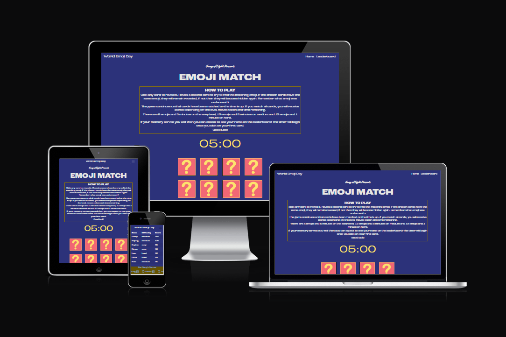
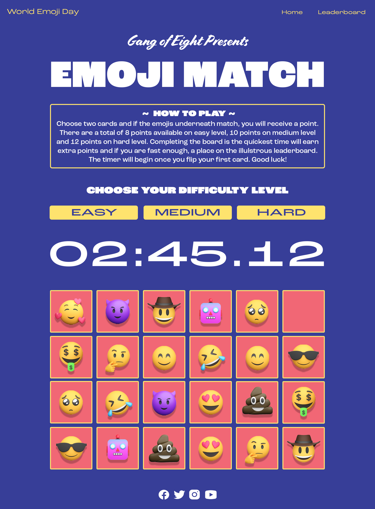
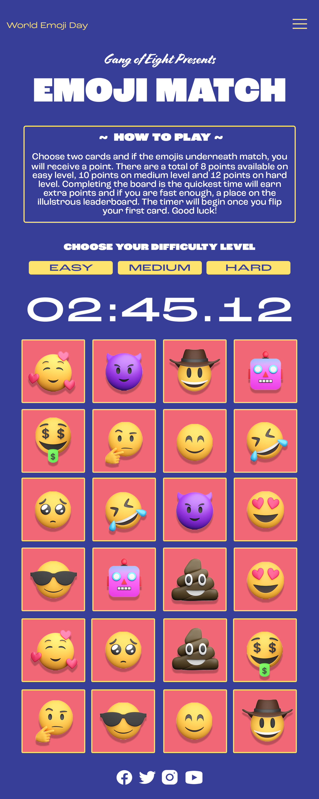
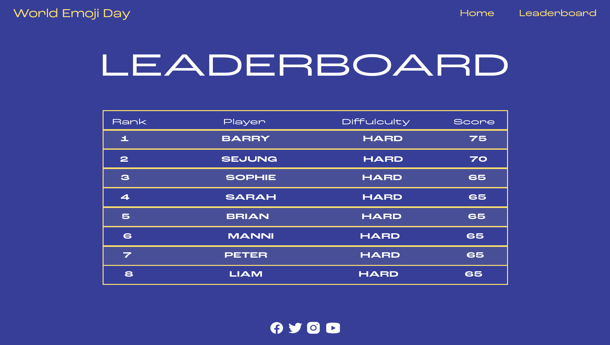

# EMOJI MATCH

[Here is a link to the final project](https://barry-greaves.github.io/world-emoji-day/)

## INITIAL DESIGN
* The initial idea for this project was to create a fun, interactive card matching game with a Emoji theme that can be enjoyed by anyone. My target audience is anyone who is interested in games and also Emojis. The target demographic is incredibly mixed and covers people of all ages and genders.

## FINAL DESIGN

## CONTENTS

* [User Experience](#USER-EXPERIENCE-(UX))
    * [User Stories](#USER-STORIES)    

* [Design](#DESIGN)   
    * [Color Scheme](#COLOR-SCHEME)

* [Wireframes](#WIREFRAMES) 

* [Features](#features)
    * [Implemented Features](#implemented-features)
    * [Future Implementations](#future-implementations)

* [Technologies Used](#TECHNOLOGIES-USED) 
    * [Languages Used](#LANGUAGES-USED)
    * [Programs Used](#PROGRAMS-USED)

* [Deployment](#DEPLOYMENT)
    * [Initial Deployment](#INITIAL-DEPLOYMENT)
    * [How To Fork A Repository](#HOW-TO-FORK-A-REPOSITORY)
    * [How To Clone A Repository](#HOW-TO-CLONE-A-REPOSITORY)
    * [How To Make A Local Clone](#HOW-TO-MAKE-A-LOCAL-CLONE)

* [Testing](#TESTING)
    * [Code Validators](#CODE-VALIDATORS)

* [Content](#CONTENT)
    * [Images](#IMAGES)
    * [Text Content](#TEXT-CONTENT)

## USER EXPERIENCE (UX)

## USER STORIES

#### CLIENT GOALS

- To provide an intuitive website that a user can understand the site’s main purpose, navigate easily and wants to use for a long period.
- To provide a game which can improve attention to detail and concentration skills and memory.

#### FIRST TIME VISITORS

- As a user,
    - I want to know what this site is about immediately so that I can quickly decide whether I want to explore it more.
    - I want to be able to navigate pages easily so that I can quickly find content.
    - I want to know how to play the game so that I can enjoy it fully.
    - I want to be able to play the game regardless of the device so that I can play it anywhere I want.
    - I want to be able to change the difficulty settings so that my kids can play it too.
    - I want to get a warning when there’s a little time left so that I can speed up.
    - I want to be able to restart a game during play so that I can reset settings.
    - I want to be able to check my scores so that I can see how good my memory is.

## DESIGN

## COLOR SCHEME

## WIREFRAMES

## FEATURES

### IMPLEMENTED FEATURES

The site features a fully responsive design and contains 2 pages(Home, Leaderboard). The header and footer are identical for all pages.

- Header

    - The fully responsive navigation bar includes links to the Home and Leaderboard page.
    - The navigation menu collapses on small devices less than 992px width.

- Footer

    - The footer contains collaborators' names and links to their GitHub and LinkedIn Pages which open in a new tab.

- Homepage

    - The homepage includes the title, rule and game board to allow the user to see easily what the site is about.

- Game

    - The images behind the cards are emojis as the hackathon is for celebrating __World emoji day__.
    - The user can select three different game levels to allow all age groups to play.
    - The number of cards and time vary depending on the game level.
    - The user can reset the game while playing.
    - When the user matches all cards, a modal pops-up allow them to enter their name and updating the leaderboard, if their score is in the top 10.

- Leaderboard

    - This page displays the name and difficulty, for the top 10 players, with the highest scores.

### FUTURE IMPLEMENTATIONS

- The game would be more enjoyable if there were background music and/or sound effects that the user can control.

## TECHNOLOGIES USED

### LANGUAGES USED

       

### PROGRAMS USED

#### Font Awesome:
[Font Awesome](https://fontawesome.com/) was using for a few icons used in the footer aspect of the site pages.

#### Google Fonts:
[Google Fonts](https://fonts.google.com/) was used for all the text content on the site pages.

#### Git
[Git](https://git-scm.com/) was used for version control by using the Gitpod terminal to add and commit to Git and push to Github.

#### GitPod
[GitPod](https://gitpod.io) was used as an IDE whilst coding this site.

#### GitHub
[GitHub](https://github.com/) is being used to store all the code for this project after being pushed from GitPod.

#### Am i Responsive
[Am i Responsive](http://ami.responsivedesign.is/) was used to create the image in my [Final Design](#final-design) section.

#### Photoshop:
Photoshop was used in the initial design process to make wireframes.

#### Firefox Developer Tools:
Firefox Developer Tools was used for trouble shooting and trying new visual changes without it affect the current code already created.

## DEPLOYMENT:

### INITIAL DEPLOYMENT

This site was deployed using GitHub Pages with the following the steps below:

1. Login or Sign Up to [GitHub](www.github.com).
2. Create a new repository named "world-emoji-day".
3. Once created, click on "Settings" on the navigation bar under the repository title.
4. Click on "Pages", on the left hand side below Secrets.
5. Under "Source", choose which branch you wish to deploy, In most cases it will be "main".
6. Choose which folder to deploy from, generally from "/root".
7. Click "Save", then wait for it to be deployed. It may take some time for the page to be fully deployed.
8. The URL will be displayed above the "source" section in GitHub Pages.

### HOW TO FORK A REPOSITORY

If you need to make a copy of a repository:

1. Login or Sign Up to [GitHub](www.github.com).
2. On GitHub, go to [Barry-Greaves/world-emoji-day](https://github.com/Barry-Greaves/world-emoji-day).
3. In the top right corner, click "Fork".

### HOW TO CLONE A REPOSITORY

If you need to make a clone:    

1. Login in to [GitHub](www.github.com).
2. Fork the repository `Barry-Greaves/world-emoji-day` using the steps above in [How To Fork a Repository](#HOW-TO-FORK-A-REPOSITORY).
3. Above the file list, click "Code".
4. Choose if you want to close using HTTPS, SSH or GitHub CLI, then click the copy button to the right.
5. Open Git Bash.
6. Change the directory to where you want your clone to go.
7. Type git clone and then paste the URL you copied in step 4.
8. Press Enter to create your clone.

### HOW TO MAKE A LOCAL CLONE

If you need to make a local clone:   

1. Login in to [GitHub](www.github.com).
2. Under the repository name, above the list of files, click "Code".
3. Here you can either Clone or Download the repository.
4. You should close the repository using HTTPS, clicking on the icon to copy the link.
5. Open Git Bash.
6. Change the current working directory to the new location, where you want the cloned directory to be.
7. Type git clone and then paste the URL you copied in step 4.
8. Press Enter, and your local clone will be created.

## TESTING

## **Contents**

* [**Testing**](#testing)
  * [**Navigation**](#navigation)
  * [**Buttons**](#buttons)
  * [**Home Page**](#home-page)
  * [**Leaderboard**](#leaderboard)
  
# **Testing**

### **Navigation** 
    - all pages

| Feature        | Expected           | Testing  | Result | Pass/Fail |
| ------------- |-------------| -----|  ---------- | :----: |
| Home | To redirect to home page| Pressing the home | Button navigates to home | Pass |
| Nav links | Clicking GitHub & LinkedIn icons takes user to developer's accounts in a new tab | Pressing all social media icons | Redirected to GitHub/LinkedIn | Pass |
| Leaderboard | Clicking Leaderboard takes user to the Leaderboard | Pressing Leaderboard | Redirected to Leaderboard | Pass |
| World Emoji Day | Clicking World Emoji Day takes user to the homepage | Pressing World Emoji Day | Redirected to Homepage| Pass |

[Back to contents](#contents)

### **Buttons**
  - all pages - on desktop site

| Feature        | Expected           | Testing  | Result | Pass/Fail |
| ------------- |-------------| -----|  ---------- | :-----:|
| Easy Button | Button changes colour when user hovers the mouse over it. Pressing the button results in changing the difficulty of the game to easy | Hover mouse over the button & pressing the button | Button change colour when hovered over and modifies the game difficulty when clicked | Pass |
| Medium Button | Button changes colour when user hovers the mouse over it. Pressing the button results in changing the difficulty of the game to medium | Hover mouse over the button & pressing the button | Button change colour when hovered over and modifies the game difficulty when clicked | Pass |
| Hard Button | Button changes colour when user hovers the mouse over it. Pressing the button results in changing the difficulty of the game to hard | Hover mouse over the button & pressing the button | Button change colour when hovered over and modifies the game difficulty when clicked | Pass |
| Reset Button | Button changes colour when user hovers the mouse over it. Pressing the button results in resetting the game | Hover mouse over the button & pressing the button | Buttons change colour when hovered over and resets the game | Pass |

### **Home Page**

| Feature        | Expected           | Testing  | Result | Pass/Fail |
| ------------- |-------------| -----|  ---------- |:----:|
| The match game | Start and finish the game succesfully on any difficutly. | Finishing the game on all difficulties | Once the game is finished, user is asked to type their name for the leaderboard update | Pass |

[Back to contents](#contents)

### **Leaderboard**

| Feature        | Expected           | Testing  | Result | Pass/Fail |
| ------------- |-------------| -----|  ---------- | :----:|
| Shows top 10 players, their name, difficulty and their score | Full table is displayed | Pressing Leaderboard | Upon clicking the leaderboard, user is redirected to the leaderboard page | Pass |

[Back to contents](#contents)

### CODE VALIDATORS

The W3C Markup Validator and W3C CSS Validator was used to validate my project to make sure there were no errors within the site.

* W3C HTML Validator Results
    * [HTML]()
* W3C CSS Validator Results
    * [CSS]()
* JavaScript Validator
 

### FULL TESTING

[Click Here](testing.md) to view the full testing steps that were completed on every device and browser.

### LIGHTHOUSE

* I tested my website using Firefox Developer Tools Lighthouse feature, and received the results below:

### DESKTOP

### MOBILE

## CONTENT

### IMAGES
