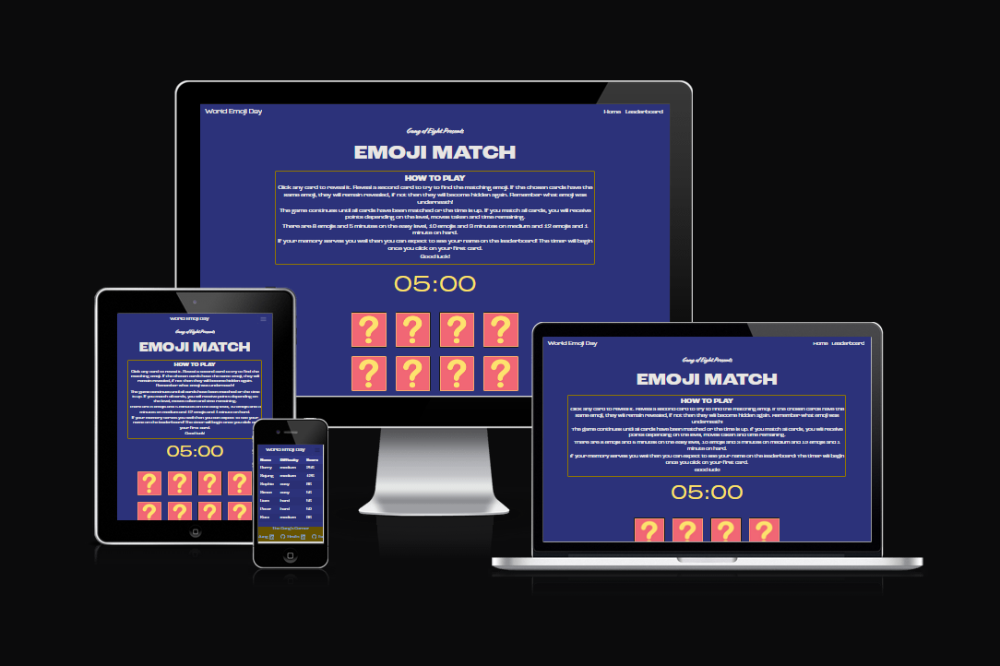

## **Contents**

* [**Testing**](#testing)
  * [**Navigation**](#navigation)
  * [**Buttons**](#buttons)
  * [**Home Page**](#home-page)
  * [**Leaderboard**](#leaderboard)
  
# **Testing**

### **Navigation** 
    - all pages

| Feature        | Expected           | Testing  | Result | Pass/Fail |
| ------------- |-------------| -----|  ---------- | :----: |
| Home | To redirect to home page| Pressing the home | Button navigates to home | Pass |
| Nav links | Clicking GitHub & LinkedIn icons takes user to developer's accounts in a new tab | Pressing all social media icons | Redirected to GitHub/LinkedIn | Pass |
| Leaderboard | Clicking Leaderboard takes user to the Leaderboard | Pressing Leaderboard | Redirected to Leaderboard | Pass |
| World Emoji Day | Clicking World Emoji Day takes user to the homepage | Pressing World Emoji Day | Redirected to Homepage| Pass |

[Back to contents](#contents)

### **Buttons**
  - all pages - on desktop site

| Feature        | Expected           | Testing  | Result | Pass/Fail |
| ------------- |-------------| -----|  ---------- | :-----:|
| Easy Button | Button changes colour when user hovers the mouse over it. Pressing the button results in changing the difficulty of the game to easy | Hover mouse over the button & pressing the button | Button change colour when hovered over and modifies the game difficulty when clicked | Pass |
| Medium Button | Button changes colour when user hovers the mouse over it. Pressing the button results in changing the difficulty of the game to medium | Hover mouse over the button & pressing the button | Button change colour when hovered over and modifies the game difficulty when clicked | Pass |
| Hard Button | Button changes colour when user hovers the mouse over it. Pressing the button results in changing the difficulty of the game to hard | Hover mouse over the button & pressing the button | Button change colour when hovered over and modifies the game difficulty when clicked | Pass |
| Reset Button | Button changes colour when user hovers the mouse over it. Pressing the button results in resetting the game | Hover mouse over the button & pressing the button | Buttons change colour when hovered over and resets the game | Pass |

### **Home Page**

| Feature        | Expected           | Testing  | Result | Pass/Fail |
| ------------- |-------------| -----|  ---------- |:----:|
| The match game | Start and finish the game succesfully on any difficutly. | Finishing the game on all difficulties | Once the game is finished, user is asked to type their name for the leaderboard update | Pass |

[Back to contents](#contents)

### **Leaderboard**

| Feature        | Expected           | Testing  | Result | Pass/Fail |
| ------------- |-------------| -----|  ---------- | :----:|
| Shows top 10 players, their name, difficulty and score | Full table is displayed | Pressing Leaderboard | Upon clicking the leaderboard, user is redirected to the leaderboard page | Pass |

[Back to contents](#contents)